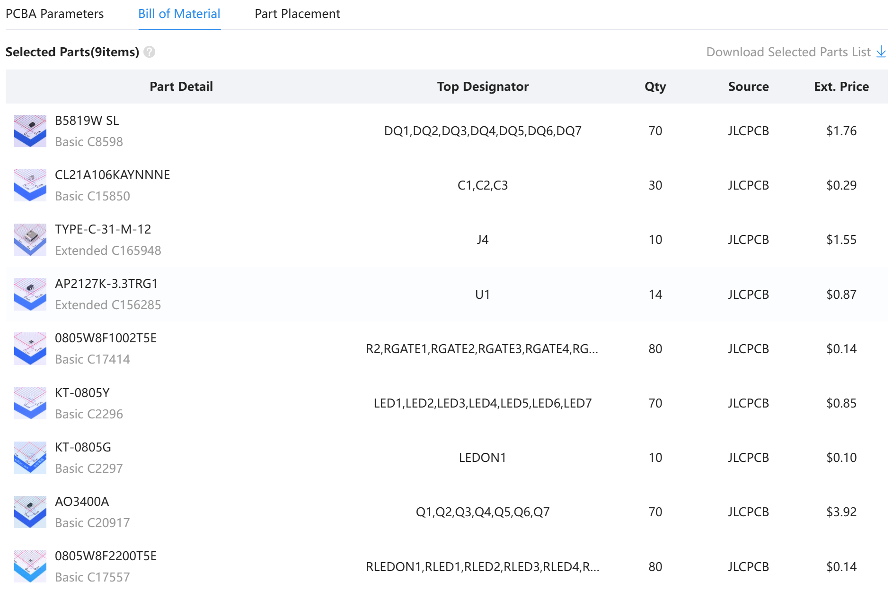
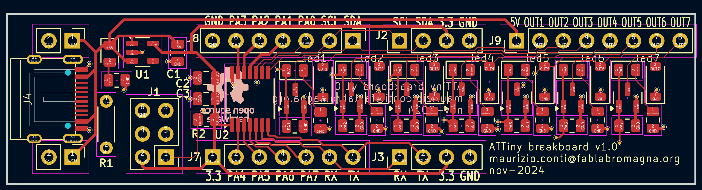
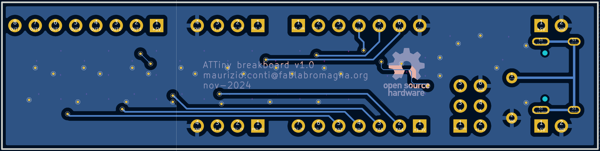
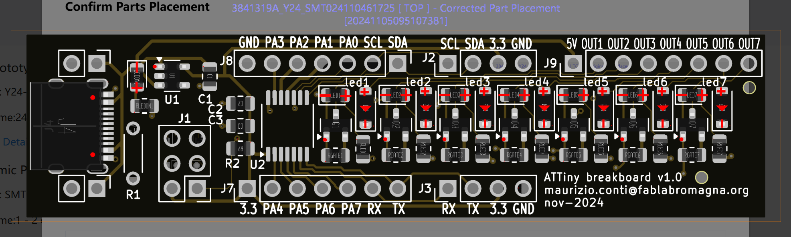
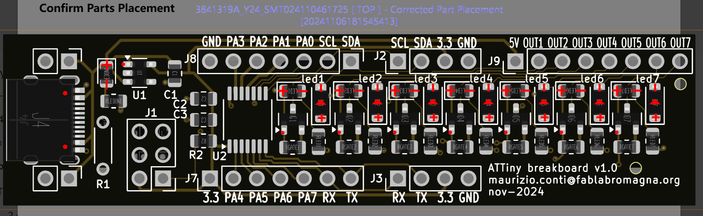
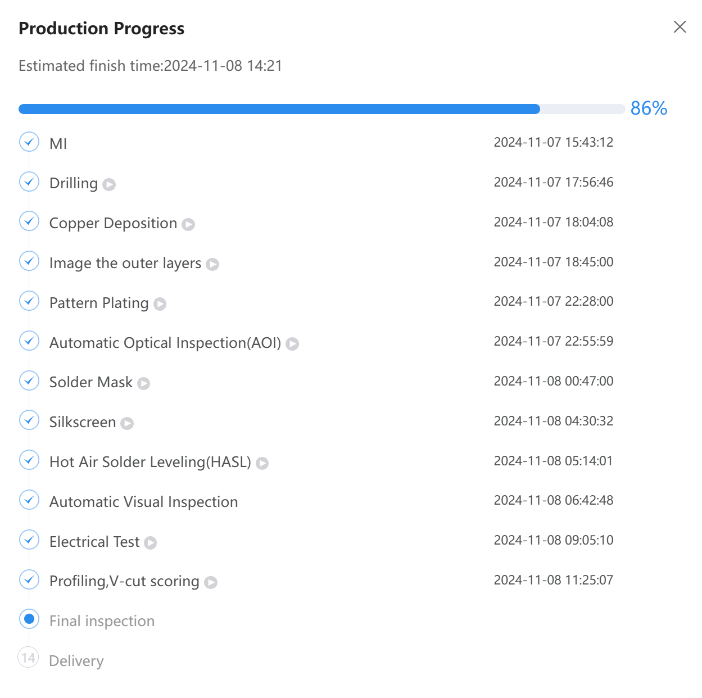

# christmas-sign
Tre pomeriggi di open lab per realizzare insieme delle decorazioni a LED utilizzando CAD 2D-3D, Stampa 3D a colori, coding Arduino e Circuit Python.

# Circuito di controllo dei led
Il primo disegno KiCad prodotto è nella cartella ATtiny3.

La scelta di utilizzare un ATtiny è legata alla semplicità ed economicità di questa serie di microcontrollori.

L'idea era quella di creare un circuito che:
- potesse essere usato su una breadboard per i primi esperimenti
- fosse alimentabile con un cavo USB-C
- avesse a bordo un regolatore per 3.3v
- portasse fuori tutti i pin del'ATTiny
- avesse a bordo i driver di potenza per pilotare i led direttamente
- potesse essere programmato con un connettore UPDI standard a 6 pin (di cui solo 3 utilizzati)

Molti componenti sono SMD basic che non richiedono quindi una spesa aggiuntiva per il cambio reel sul Pick and place di JLCPCB.

Gli unici componenti extended sono:
- il connettore USB-C
- il regolatore di tensione 3.3v
- la CPU

La prima produzione di 10 schede per un totale di 434 componenti montati in SMD è costata 37 euro comprese VAT e shipping. (avevo un buono sconto di 8,26 euro)

A queste spese bisogna aggiungere le 10 CPU comprate su Mouser a 9,39 che andranno saldate a mano.

JLCPCB infatti non ha a catalogo queste CPU (ATtiny1624)

Fronte

Retro

Schema

Vista 3D

Pdf dello schema **[PDF](ATtiny3/Immagini/Schema.pdf)**.

Così lo volevano loro...

Così lo volevo io...

Ci siamo messi d'accordo.
I diodi erano giusti ma a loro non piacevano.

Quando arriveranno i circuiti montati sapremo chi aveva ragione.

